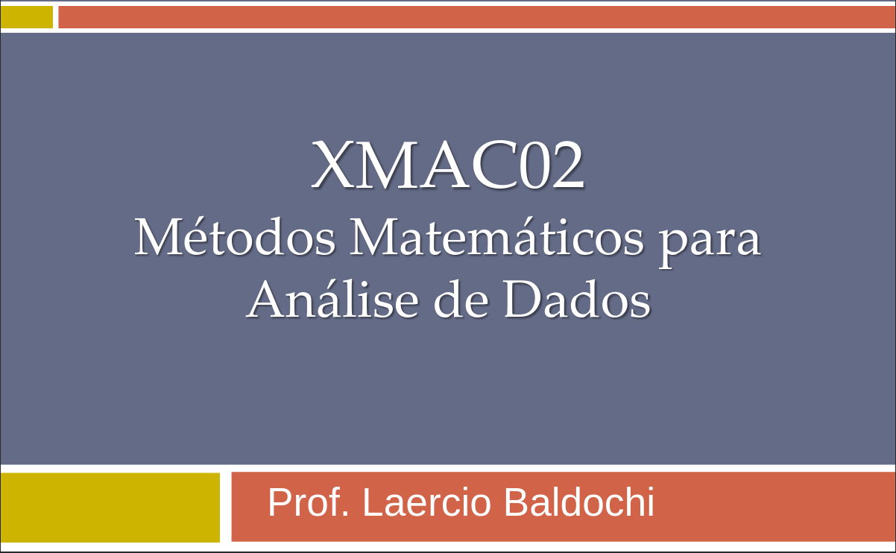

# Repositório da Disciplina **XMAC02 - Métodos Matemáticos para Análise de Dados**

## Descrição
Este repositório contém materiais, códigos e arquivos relacionados à disciplina **XMAC02 - Métodos Matemáticos para Análise de Dados**. O foco está na aplicação de métodos matemáticos para resolver problemas de análise de dados utilizando ferramentas como Python e Jupyter Notebook.

## Conteúdo
- **Atividades Avaliativas**: Exercícios e trabalhos práticos.
- **Implementações**: Códigos desenvolvidos em Python.
- **Materiais Complementares**: Arquivos Jupyter Notebook e PDFs.

---

Desenvolvido para a disciplina **XMAC02 - Métodos Matemáticos para Análise de Dados**.
